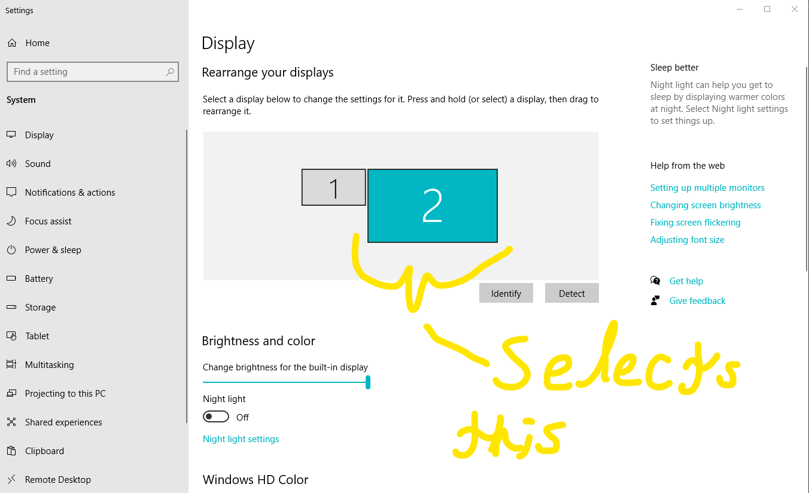
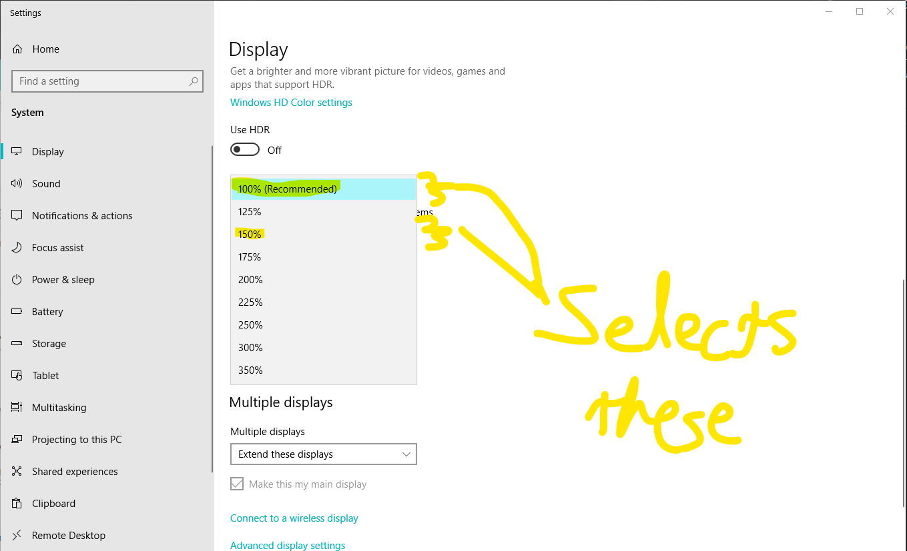

# Auto_Resize_Windows_Zoom

Two batch scripts that sends [keyboard input](https://ss64.com/vb/sendkeys.html) to automatically change my secondary display to 150% scaling and back to 100%.

Change the number or `TABS` or `UP`/`DOWND`'s in this line to suit your individual system needs:
```
ECHO WshShell.SendKeys "+{TAB 5}{ENTER}{TAB 8}{UP 2}"     >>"%TempVBSFile%"
```
> *Remove the `+{TAB 5}{ENTER}` if you don't need to switch to your secondary display.


